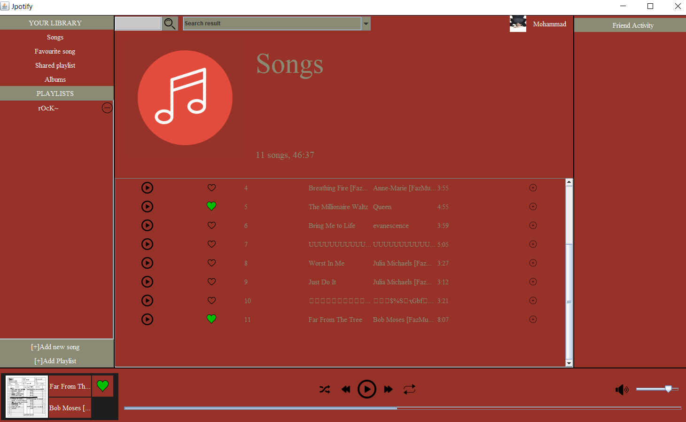
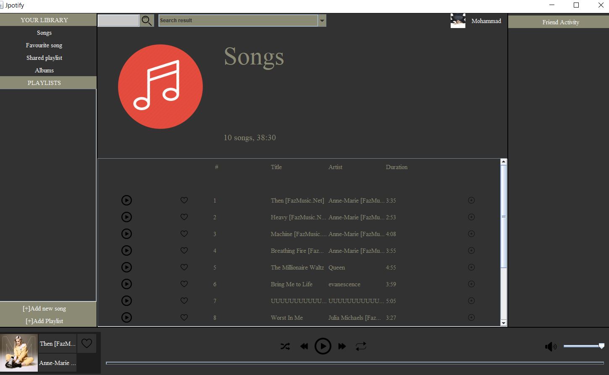

# Jpotify
By pwdz and (taratt)[https://github.com/taratt]
### Intro
This project is a **music-player** having the following features:
- Adding songs/playlist from your computer
- Play/Pause
- Going to next/previous song
- Creating/Removing playlist
- Searching between songs
- Libraries including **Favourite Songs**, **Shared Playlist**, **Albums**, **Songs**
- Shuffle mode
- Repeat
- Adding songs to Libraries/Playlist
- Removing songs from Libraries/Playlist
- Increasing/Decreasing the sound 
- Showing **music's name** and **artwork** and **duration** and **singer's name**
- Friend Activity which you can get your friends playlist and their currently being played song(not completed)  


### Details
The **Design Pattern** used for this project is **MVC**(well it was our first try for a design pattern so it might not be exactly it!)  

GUI is written by using **Java Swing** and layouts such as **GridBagLayout**, **BorderLayout**, **GridLayout**.  

The color of the UI can be changed easily by changing one color in code(in package GUI in class Essentials in static method getColor()).
```
public static Color getColor(String colorName) {
    switch (colorName) {
        case "light grey":
            return new Color(220, 220, 214);
        case "grey":
            return new Color(138, 138, 117);
        case "heavy grey":
            return new Color(100, 50, 40);//Change this and the Background color will change
        case "blue":
            return new Color(12, 12, 100);
        case "red":
            return new Color(100, 12, 12);
        case "yellow":
            return new Color(160, 170, 0);
        case "near black":
            return new Color(30, 30, 30);
        case "grey2":
            return new Color(70, 40, 40);
        case "green":
            return new Color(10, 100, 50);
        case "light red":
            return new Color(60,40,40);
        default:
            return new Color(0, 0, 0);
    }
}
```

Multiple **clients** can be connected to the **server**.(network branch)
A serializable class name Info contains all the information which is going to be send to server and clients.